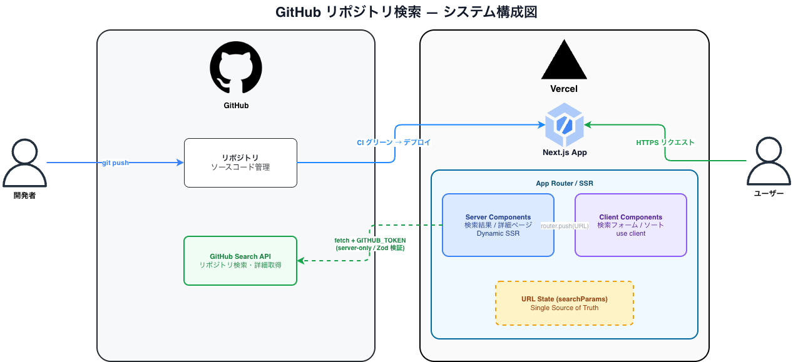
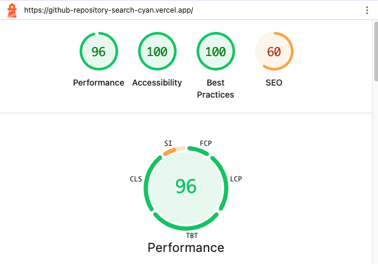
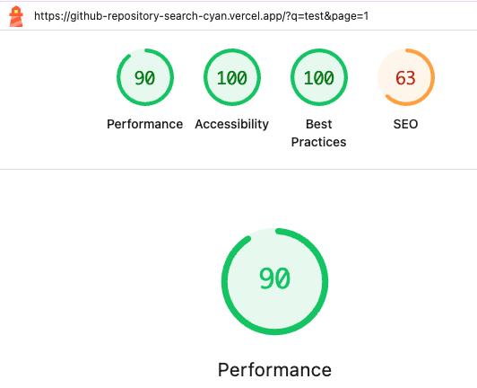
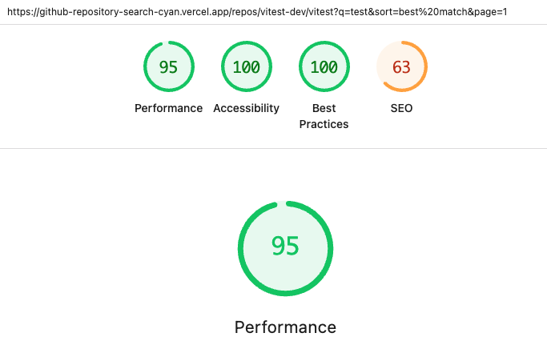
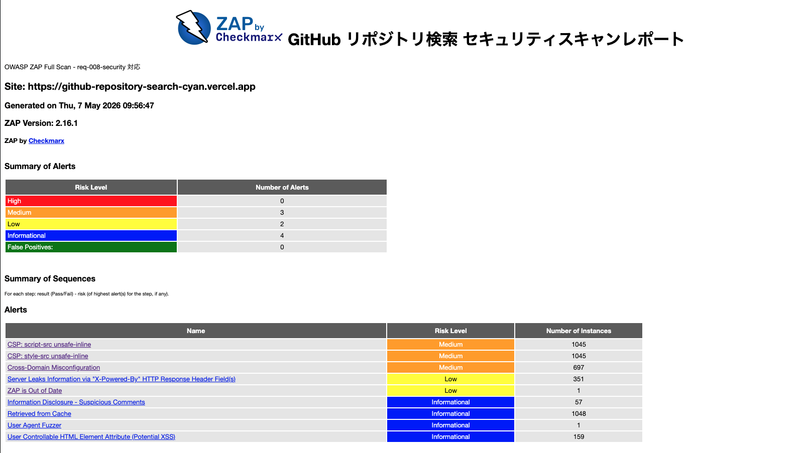

# GitHub リポジトリ検索

GitHub Search API を使ってリポジトリを検索・詳細表示する Web アプリです。

> アプリケーションの確認は[こちら](https://github-repository-search-cyan.vercel.app/)から

## 目次

- [GitHub リポジトリ検索](#github-リポジトリ検索)
  - [目次](#目次)
  - [概要](#概要)
  - [機能](#機能)
  - [スクリーンショット](#スクリーンショット)
    - [モバイル](#モバイル)
    - [タブレット](#タブレット)
    - [PC](#pc)
  - [システム構成図](#システム構成図)
  - [URL 構成](#url-構成)
  - [技術スタック](#技術スタック)
  - [アーキテクチャ：Feature-Sliced Design (FSD)](#アーキテクチャfeature-sliced-design-fsd)
  - [ディレクトリ構成](#ディレクトリ構成)
  - [品質](#品質)
    - [パフォーマンス](#パフォーマンス)
      - [ホーム画面](#ホーム画面)
      - [検索画面](#検索画面)
      - [詳細画面](#詳細画面)
    - [セキュリティ](#セキュリティ)
    - [アクセシビリティ](#アクセシビリティ)
  - [Trade-offs](#trade-offs)
    - [URL 駆動の真 SSR を選んだ理由](#url-駆動の真-ssr-を選んだ理由)
    - [やらなかったこと](#やらなかったこと)
    - [パフォーマンスに関する判断](#パフォーマンスに関する判断)
  - [設計指針](#設計指針)
  - [開発者向け](#開発者向け)
  - [振り返り](#振り返り)
  - [ライセンス](#ライセンス)

## 概要

| 項目       | 内容                                     |
| ---------- | ---------------------------------------- |
| 種別       | Web アプリ（SSR / Next.js App Router）   |
| 対応画面   | モバイル・タブレット・PC（レスポンシブ） |
| 言語       | 日本語                                   |
| デプロイ先 | Vercel                                   |
| 検索 URL   | `/?q=<keyword>`                          |
| 詳細 URL   | `/repos/<owner>/<repo>`                  |

## 機能

- **キーワード検索** — GitHub Search API でリポジトリを検索
- **検索結果一覧** — オーナー・スター数・言語などを一覧表示
- **ソート** — ベストマッチ / スター数 / フォーク数 / 更新日時で並び替え
- **詳細ページ** — 名前・オーナーアイコン・言語・Star / Watcher / Fork / Issue 数を表示（モーダルではなく専用ページ）
- **ページネーション** — URL クエリ駆動（`?page=N`）、ブラウザバック・URL 共有に対応
- **ローディング / エラー / 空状態** — スケルトン UI、Rate Limit / ネットワークエラー時の専用メッセージ

## スクリーンショット

### モバイル


### タブレット


### PC


## システム構成図



## URL 構成

| 画面                   | URL                              | レンダリング             |
| ---------------------- | -------------------------------- | ------------------------ |
| 検索（初期）           | `/`                              | Server Component（静的） |
| 検索結果               | `/?q=react`                      | Dynamic SSR              |
| 検索結果（ページ指定） | `/?q=react&page=2`               | Dynamic SSR              |
| リポジトリ詳細         | `/repos/<オーナー>/<リポジトリ>` | Dynamic SSR              |

**アプリケーション状態 = URL** が Single Source of Truth。グローバルクライアントストアは持ちません。

## 技術スタック

| 用途                      | 採用                     | バージョン |
| ------------------------- | ------------------------ | ---------- |
| フレームワーク            | Next.js (App Router)     | 16.1.x     |
| 言語                      | TypeScript               | 5.x        |
| UI コンポーネント         | shadcn/ui + Tailwind CSS | v4         |
| Unit / Integration テスト | Vitest + Testing Library | 4.x        |
| E2E テスト                | Playwright               | 1.x        |
| パッケージマネージャ      | pnpm                     | 11.x       |

## アーキテクチャ：Feature-Sliced Design (FSD)

`app` → `widgets` → `features` → `entities` → `shared` の5層。**上位から下位への一方向依存のみ**許可。

| 層          | 役割                                                                   |
| ----------- | ---------------------------------------------------------------------- |
| `app/`      | Next.js App Router。ルーティング・レイアウト・ページ                   |
| `widgets/`  | 複数 features / entities を組み合わせた表示単位（リスト + ヘッダー等） |
| `features/` | ユーザー操作・ユースケース（検索フォーム・ソートセレクタ等）           |
| `entities/` | ドメインモデル・API クライアント・エンティティ UI                      |
| `shared/`   | 汎用ユーティリティ・UI 基盤（shadcn/ui ラッパー、設定、型）            |

## ディレクトリ構成

```text
.
├── app/                              # Next.js App Router
│   ├── page.tsx                      # [Server] 検索ページ
│   ├── repos/
│   │   └── [owner]/[repo]/
│   │       ├── page.tsx              # [Server] 詳細ページ
│   │       └── loading.tsx
│   ├── layout.tsx
│   ├── error.tsx                     # [Client] エラー境界
│   └── not-found.tsx
├── widgets/
│   ├── repository-list/              # 検索結果一覧 + ページネーション
│   └── site-header/                  # サイトヘッダー
├── features/
│   └── search-repositories/
│       ├── ui/
│       │   ├── search-form.tsx       # [Client] 検索フォーム
│       │   └── sort-selector.tsx     # [Client] ソートセレクタ
│       └── model/
│           └── schema.ts             # searchParams の Zod スキーマ
├── entities/
│   └── repository/
│       ├── api/
│       │   └── github-api.ts         # GitHub API クライアント（server-only）
│       ├── model/
│       │   └── types.ts              # Zod から推論した型定義
│       └── ui/
│           └── repository-card.tsx   # [Server] リポジトリカード
├── shared/
│   ├── config/                       # 定数・環境変数
│   ├── lib/                          # 汎用ユーティリティ・ロガー
│   ├── types/                        # 共有型定義
│   └── ui/                           # shadcn/ui コンポーネント
├── tests/
│   ├── e2e/                          # Playwright E2E（*.spec.ts）
│   └── integration/                  # Vitest Integration（*.test.tsx）
└── specs/
    ├── ears/                         # EARS 要件定義
    └── gherkin/                      # Gherkin シナリオ
```

## 品質

### パフォーマンス

Lighthouse（本番環境）でのスコアです。SEO が 60 台なのは `robots.txt` で `Disallow: /` を設定しているためで、意図的な結果です。

#### ホーム画面



#### 検索画面



#### 詳細画面



| 画面     | Performance | Accessibility | Best Practices | SEO |
| -------- | ----------- | ------------- | -------------- | --- |
| ホーム   | 96          | 100           | 100            | 60  |
| 検索結果 | 90          | 100           | 100            | 63  |
| 詳細     | 95          | 100           | 100            | 63  |

### セキュリティ


OWASP ZAPによるスキャン結果の詳細と対応は[セキュリティレポート](docs/security-report.md)参照してください。

| 観点                 | 対策                                                                     |
| -------------------- | ------------------------------------------------------------------------ |
| API トークン         | 環境変数管理、Server 側のみ使用、`NEXT_PUBLIC_` 接頭辞禁止               |
| `server-only`        | API クライアントに付与、クライアントバンドルへの混入をビルドエラーで検出 |
| 入力検証             | 検索クエリ・`searchParams` を Zod でバリデーション                       |
| XSS                  | React デフォルトエスケープに依存、`dangerouslySetInnerHTML` 不使用       |
| セキュリティヘッダー | CSP / X-Frame-Options / Referrer-Policy / X-Content-Type-Options / HSTS  |
| 依存関係             | `pnpm audit` を CI に組み込み + Dependabot                               |

### アクセシビリティ

WCAG 2.1 AA 準拠を目標。

| 観点               | 対策                                                   |
| ------------------ | ------------------------------------------------------ |
| キーボード操作     | フォーカスリング維持、論理的な Tab 順序                |
| スクリーンリーダー | `aria-label`、`aria-live="polite"`（動的更新通知）     |
| Loading 状態       | `aria-busy`、視覚 + テキスト両方で通知                 |
| エラーメッセージ   | `aria-describedby` でフォームと紐付け                  |
| ランドマーク       | `<main>`、`<nav>`、`<form role="search">` の適切な使用 |
| 画像               | オーナーアイコンに `alt="<owner>のアイコン"`           |

## Trade-offs

### URL 駆動の真 SSR を選んだ理由

検索状態を URL に乗せ、async Server Component で SSR する方式を採用しました。

| 比較した案                  | 却下理由                                                        |
| --------------------------- | --------------------------------------------------------------- |
| 全 CSR（TanStack Query）    | API トークンがクライアントに露出する                            |
| CSR + Route Handler 経由    | 実装は楽だが、App Router の思想（Server First）を活かしきれない |
| PPR（Partial Prerendering） | 検索結果は完全に動的でメリット薄、Next.js 16 でもまだ実験的     |
| ISR                         | Star 数等は頻繁に変わるため整合性が取りづらい                   |
| Server Actions              | GET セマンティクスが自然な操作に POST 強制は不適                |

URL 駆動 SSR を採用することで、**URL 共有・ブラウザバック・リロード耐性・プログレッシブエンハンスメント**が自然に実現しました。

### やらなかったこと

| 項目                              | 理由                                                             |
| --------------------------------- | ---------------------------------------------------------------- |
| 無限スクロール                    | URL 駆動と相性が悪い（状態が URL に乗らない）                    |
| ダークモード                      | スコープ外（shadcn/ui で後から追加は容易）                       |
| 多言語対応                        | スコープ外（テキストは定数化済みで拡張可能）                     |
| SEO 対策                          | ログイン前提サービス想定、`robots.txt` で `Disallow: /`          |
| Docker 化                         | Vercel が自動でビルド、不要                                      |
| Storybook                         | コンポーネント数が少なく、Integration テストで代替               |
| 視覚回帰テスト                    | shadcn/ui 使用で UI 変動が小さい                                 |
| IaC                               | Vercel CLI / Dashboard で十分、Terraform 等は過剰                |
| 認証・認可                        | 公開 API のみ利用、ログインが不要なユースケース                  |
| 独自 API                          | GitHub Search API を直接呼ぶ設計で中間 API レイヤー不要          |
| DB                                | 永続化対象なし、状態は URL と GitHub API で完結                  |
| CD                                | Vercel の GitHub 連携で main マージ時に自動デプロイ済み          |
| Git フック（husky + lint-staged） | CI で同等チェックを実施済み、ローカルフックの二重管理は過剰      |
| CSpell 等の細かい静的解析         | ESLint + TypeScript で主要品質を担保、スペルチェックはスコープ外 |
| 性能テスト（k6）                  | GitHub API の Rate Limit 制約があり負荷テストの実施が困難        |

### パフォーマンスに関する判断

- 検索ページの初期状態（クエリなし）は API を呼ばない → **レート制限消費ゼロ・LCP 高速**
- リアルタイム検索なし、検索ボタン押下時のみ `router.push` → **API コスト削減**
- GitHub API のレート制限（未認証: 60 req/h）は PAT で 5,000 req/h に拡張
- 本番想定なら CDN 前段での Rate Limiting 追加を推奨

## 設計指針

本プロジェクトは以下の原則で実装しています。

- **Specs First** — `specs/` で振る舞いを先に定義し、仕様未定義の実装を禁止
- **Server First** — Server Component をデフォルト、`"use client"` は最小限
- **Security First** — API トークン隔離・入力検証・セキュリティヘッダーを 組み込む
- **Traceability** — 要件 ID (`req-XXX`) と Gherkin ID (`uc-XXX`) をコード・テスト名に紐付け

詳細は [AGENTS.md](./AGENTS.md) を参照してください。

## 開発者向け

セットアップ手順・コマンド・テスト実行・デプロイ・開発フローの詳細は [DEVELOPERS.md](./DEVELOPERS.md) を参照してください。

## 振り返り

AIの利用方法・工夫・こだわりについては [docs/Report.md](./docs/Report.md) を参照してください。

AIとの向き合い方の考察については [docs/AIとの向き合い方.md](./docs/AIとの向き合い方.md) を参照してください。

## ライセンス

Copyright (c) 2026 Hitamuki. All rights reserved.
